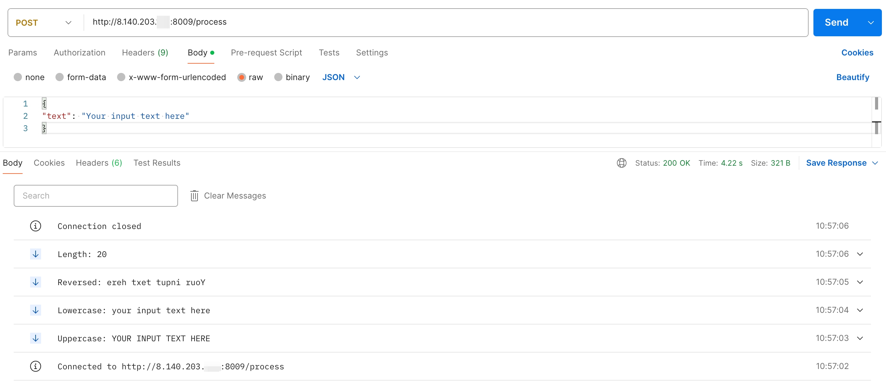

# Server-Sent Events (SSE)
- [Server-Sent Events (SSE)](#server-sent-events-sse)
  - [流式输出返回多种结果:](#流式输出返回多种结果)
    - [代码示例:](#代码示例)
    - [Postman 请求示例:](#postman-请求示例)

## 流式输出返回多种结果:

### 代码示例:

```python
from fastapi import FastAPI
from fastapi.responses import StreamingResponse
from pydantic import BaseModel
import asyncio

app = FastAPI()

# 定义请求体的数据模型
class UserInput(BaseModel):
    text: str

# 定义处理函数
async def process_text(input_text: str):
    result1 = input_text.upper()        # 转换为大写
    await asyncio.sleep(1)              # 模拟耗时操作
    yield f"data: Uppercase: {result1}\n\n"

    result2 = input_text.lower()        # 转换为小写
    await asyncio.sleep(1)              # 模拟耗时操作
    yield f"data: Lowercase: {result2}\n\n"

    result3 = input_text[::-1]          # 反转字符串
    await asyncio.sleep(1)              # 模拟耗时操作
    yield f"data: Reversed: {result3}\n\n"

    result4 = len(input_text)           # 计算字符串长度
    await asyncio.sleep(1)              # 模拟耗时操作
    yield f"data: Length: {result4}\n\n"

# 定义端点
@app.post("/process")
async def process_input(user_input: UserInput):
    return StreamingResponse(process_text(user_input.text), media_type="text/event-stream")

if __name__ == "__main__":
    import uvicorn
    uvicorn.run(app, host="0.0.0.0", port=8009)
```

### Postman 请求示例:

要使用 Postman 测试你的 FastAPI 应用程序，请按照以下步骤进行：<br>

1. **启动 FastAPI 应用程序**：

确保你在正确的环境中启动 FastAPI 应用程序，并且它在 IP 地址 `8.140.203.xxx` 上的端口 `8009` 上运行。你可以通过运行以下命令来启动它：<br>

```bash
python your_script_name.py
```

2. **打开 Postman**：

打开 Postman 应用程序。<br>

3. **创建一个新的请求**：

- 点击左上角的 "New" 按钮，然后选择 "Request"。

- 给请求命名（例如 "Test FastAPI Process"），然后点击 "Save to [你的 Collection 名称]"。

4. **配置请求**：

- 将请求方法设置为 `POST`。

- 在地址栏输入 `http://8.140.203.xxx:8009/process`。

5. **设置请求头**：

- 点击 "Headers" 选项卡，添加一个新的头：

```log
Key: Content-Type
Value: application/json
```

6. **设置请求体**：

- 点击 "Body" 选项卡，选择 "raw" 和 "JSON"。

- 输入以下 JSON 数据：

```json
{
"text": "Your input text here"
}
```

将 `Your input text here` 替换为你想测试的输入文本。<br>

7. **发送请求**：

- 点击 "Send" 按钮发送请求。

8. **查看响应**：

- 在 "Body" 选项卡下查看响应数据。你应该会看到类似如下的事件流数据：

```log
data: Uppercase: YOUR INPUT TEXT HERE

data: Lowercase: your input text here

data: Reversed: ereh txet tupni ruoY

data: Length: 17
```

